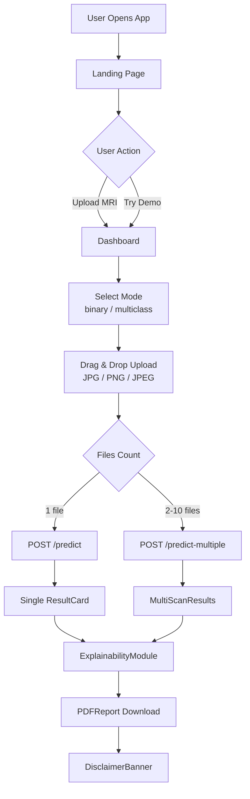
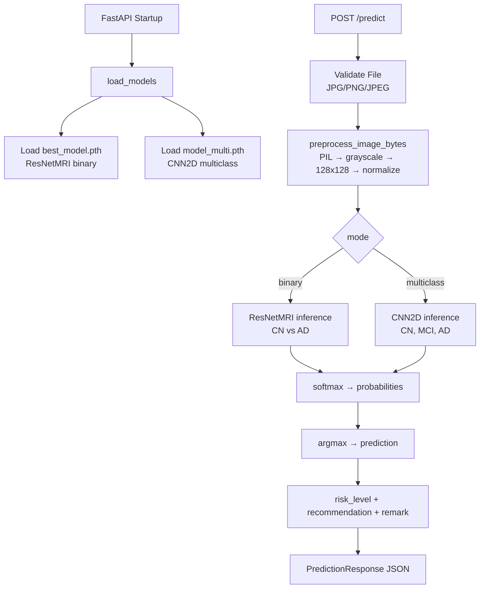
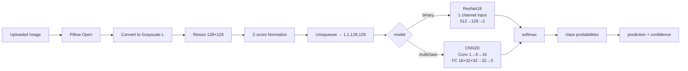
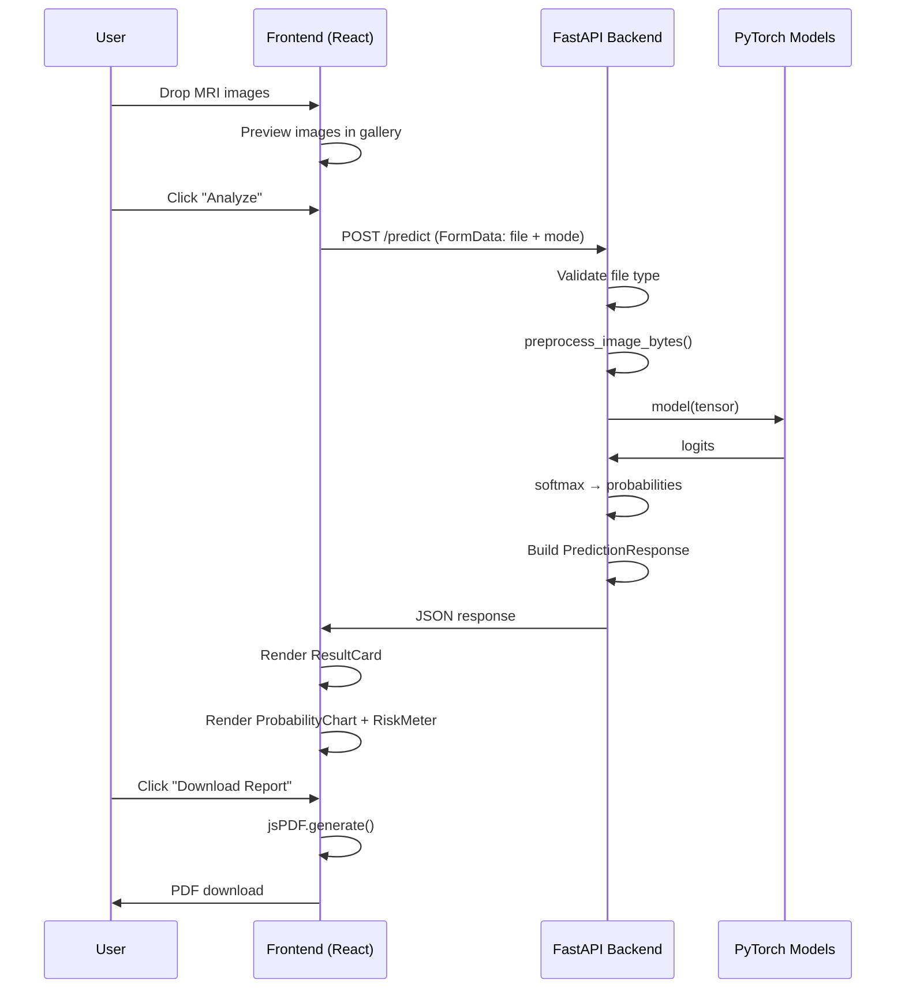

# ArcLight AI — Architecture

## Overview

ArcLight AI is a three-tier web application:

1. **Frontend** (React + Vite + TypeScript)
2. **Backend** (FastAPI + Python)
3. **AI Layer** (PyTorch models: ResNet18 + CNN2D)

---

## System Design

```
┌─────────────────────────────────────────────────────────┐
│                     USER BROWSER                        │
│  Landing Page (/):    Hero → Features → CTA             │
│  Dashboard (/dashboard): Upload → Analyze → Results     │
└───────────────────────┬─────────────────────────────────┘
                        │ HTTPS / REST
                        ▼
┌─────────────────────────────────────────────────────────┐
│                   FastAPI Backend                       │
│  POST /predict          → single image inference        │
│  POST /predict-multiple → batch image inference         │
│  GET  /health           → system health                 │
│  GET  /model-info       → model metadata                │
└───────────────────────┬─────────────────────────────────┘
                        │ PyTorch
                        ▼
┌─────────────────────────────────────────────────────────┐
│                  AI Model Layer                         │
│  ResNetMRI (ResNet-18)  → Binary: CN vs AD              │
│  CNN2D (2-layer)        → Multiclass: CN, MCI, AD       │
└─────────────────────────────────────────────────────────┘
```

---

## Frontend Flow



---

## Backend Flow



---

## Model Flow



---

## Data Flow Diagram



---

## Deployment Architecture

```
                    ┌──────────────────┐
                    │    Vercel CDN    │
                    │  (Frontend SPA)  │
                    │  React Build     │
                    └────────┬─────────┘
                             │ HTTPS API calls
                    ┌────────▼─────────┐
                    │  Render / Railway │
                    │  FastAPI + Gunicorn│
                    │  PyTorch Models  │
                    └──────────────────┘
```

---

## Security Considerations

- File type validation on backend (content-type + extension)
- Max 10 files per request
- CORS configured (tighten `allow_origins` in production)
- No PII stored — stateless inference only
- Medical disclaimer on all result views
